# Lab Instructions

Instructions to follow along with the lab

## Get your Azure login credentials
1. Launch Skillable icon saved on your desktop. On the right-side pane, you can find your login info and resource group for this lab. \
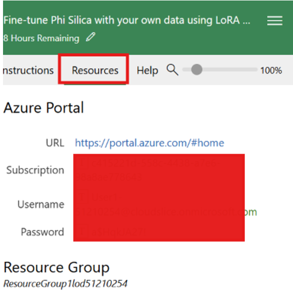

## LoRA training
1. Click on the AI Toolkit tab on the left pane of VScode. \
   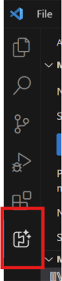
2.  Navigate to *Tools > Fine-tuning* in the left-hand sidebar to start a fine tuning workflow. \
   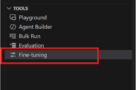
3.  Click on *New Fine-tuning Job* in the upper right and select *New Fine-tuning Project* \
   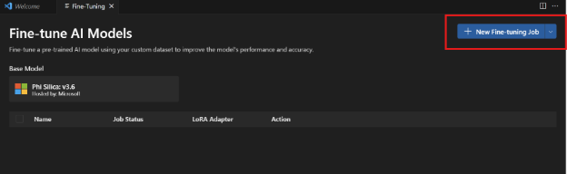
4. Enter the project name, and select a project location. \
   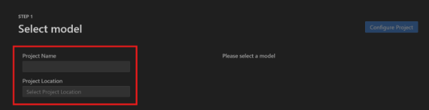
5. Select *microsoft/phi-silica* from the Model Catalog. \
   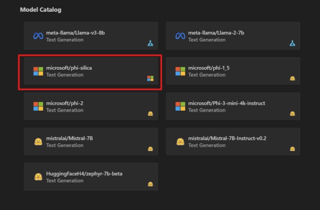
6. Click on *Configure Project* in the upper right. \
   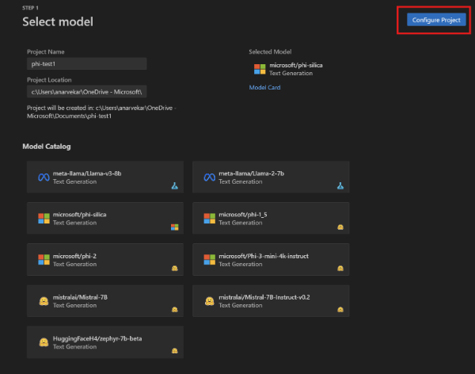
7. Select the latest version of Phi Silica. \
   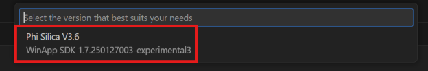
8. Under *Data > Training Dataset name* and *Test Dataset name*, select your train.json and your test.json files. The datasets are avialable in the lora_lab folder under the subfolder user_feedback_datasets. \
   
9. Click on *Generate Project* in the upper right. A new VS code window should open up. \
10. View the bicep file, this is the resource that allows you to deploy your job to Azure. This can be found under *infra > provision > finetuning.bicep*. The following should be under workloadProfiles
    Add the following under workloadProfiles 
```
{ 
         workloadProfileType: 'Consumption-GPU-NC24-A100' 
         name: 'GPU'
} 
```
11. Click on *New Fine-tuning job* in the upper right. \
    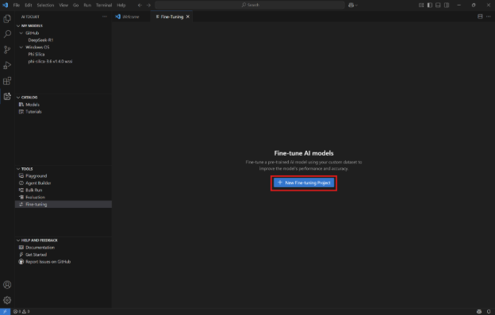
    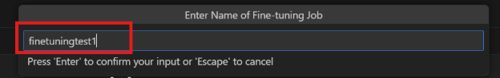
12. In the dialog, select the Microsoft account with which to access your Azure subscription. You may be redirected to login - this is where you use the credentials from the beginning of the lab instructions. \
    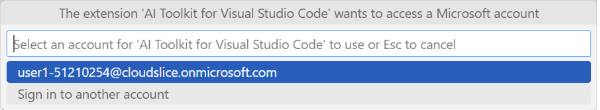
13. Select the resource group from the dropdown. \
    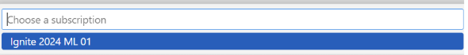
14. Done! The fine-tuning job was successfully started. \
    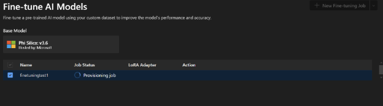
